<div align="center">


<br>


<br>


<br><br>

<a href="https://www.sakarkhadka.com.np">

</a>
<a href="https://www.linkedin.com/in/sacarkhadka">

</a>
<a href="mailto:khadka.sakar10@gmail.com">

</a>

<br><br>


</div>

---

<div align="center">

# ⚡ I BUILD SOFTWARE, NOT JUST CODE.

### Full-Stack Developer · Product Engineer · Open-Source Builder

</div>

<br>

<table>
<tr>
<td width="60%" valign="top">

## 👨‍💻 About Me

I'm **Sakar Khadka**, a full-stack developer from **Nepal 🇳🇵** focused on building products from the ground up.

I enjoy working across the entire stack — from pixel-level interfaces to database architecture, authentication, APIs, infrastructure and deployment.

I don't just ask:
> **"How do I implement this?"**
I ask:
> **"How should this system work?"**
My current interests revolve around:

- 🧠 System Design
- 💳 Fintech & Financial Systems
- 🚀 SaaS Products
- 🧰 Developer Tools
- 🌐 Full-Stack Architecture
- 📦 Open Source
- 🎨 Product & UX Engineering

</td>

<td width="40%" align="center">


</td>
</tr>
</table>
<br><br>

# 🚀 WHAT I'M BUILDING

### 💸 Munal Online
**Digital finance · remittance · wallets · digital services**
Major product work in digital financial services and remittance — the hard parts are systems, not just screens.
```text
User → Authentication → Wallet → Transaction → Ledger
     → Payment Provider → Webhook → Verification → Reconciliation
```
Authentication · wallet architecture · transactions · auditability · webhooks · idempotency · reporting · database integrity


<br/>

### 🧰 Merokarya
**SaaS · productivity · digital tools**
Product ecosystem for useful web tools and productivity software.
`Next.js` · `NestJS` · `PostgreSQL` · `TypeScript`

<a href="https://merokarya.com"></a>


### 🌐 Xenonepal
**Digital products · gaming · subscriptions**
Nepal-focused digital marketplace for digital products and services.

<a href="https://xenonepal.com"></a>

---

# 📦 I BUILD FOR DEVELOPERS TOO
<div align="center">

</div>
<table>
<tr>
<td width="50%" valign="top">

## 🇳🇵 mero-nepali-utils
### Nepali Date & Utility Library
A TypeScript utility library built around the **Bikram Sambat calendar** and Nepali development use cases.
```bash
npm install mero-nepali-utils
```
<a href="https://www.npmjs.com/package/mero-nepali-utils">
</a>
</td>
<td width="50%" valign="top">

## 🎨 KaryaX Icons
### Developer Icon Ecosystem
Building a modern icon ecosystem designed around:
```bash
npm install @karyax/icons
```
<a href="https://www.npmjs.com/package/mero-nepali-utils">
</a>
</td>
</tr>
</table>

---
<div align="center">

# 🧠 HOW I THINK ABOUT SYSTEMS

<div align="center">

```text
                     ┌──────────────────┐
                     │      PRODUCT     │
                     └────────┬─────────┘
                              │
                              ▼
                     ┌──────────────────┐
                     │    EXPERIENCE    │
                     │ React / Next.js  │
                     └────────┬─────────┘
                              │
                              ▼
                     ┌──────────────────┐
                     │       API        │
                     │ NestJS / REST    │
                     └────────┬─────────┘
                              │
                              ▼
                ┌─────────────┴─────────────┐
                │                           │
                ▼                           ▼
        ┌──────────────┐           ┌────────────────┐
        │ AUTH / RBAC  │           │ BUSINESS LOGIC │
        └──────┬───────┘           └───────┬────────┘
               │                           │
               └─────────────┬─────────────┘
                             ▼
                    ┌─────────────────┐
                    │    DATABASE     │
                    │   PostgreSQL    │
                    └────────┬────────┘
                             │
                             ▼
                    ┌─────────────────┐
                    │   OBSERVABILITY │
                    │ Sentry / OTel   │
                    └────────┬────────┘
                             │
                             ▼
                    ┌─────────────────┐
                    │   PRODUCTION 🚀 │
                    └─────────────────┘
```


---
</div>
</div>

# 🔐 ENGINEERING PRINCIPLES

<div align="center">

| 🧠  | Principle              | What it means                                                           |
| --- | ---------------------- | ----------------------------------------------------------------------- |
| 🔒  | **Security First**     | Authentication, authorization & validation are part of the architecture |
| 🧱  | **Strong Foundations** | Good schemas beat clever queries                                        |
| 🧩  | **Modularity**         | Systems should evolve without becoming spaghetti                        |
| 📈  | **Scalability**        | Design for the next version, not imaginary millions                     |
| 👀  | **Observability**      | If something breaks, I want to know why                                 |
| 🧪  | **Testing**            | Confidence before deployment                                            |
| 🎯  | **DX Matters**         | Developers are users too                                                |
| 🎨  | **UX Matters**         | A technically perfect product can still be terrible                     |

</div>

---

# 🛠️ THE STACK
<div align="center">

### CORE


### DATA


### MOBILE


**React Native · Expo**

### CLOUD & DEVOPS


### TOOLS


</div>

---

# 🏆 EXPERIENCE

<div align="center">

### FULL-STACK DEVELOPER
**Press 1 Technologies**
`React` · `Node.js` · `PostgreSQL` · `Tauri`


### FULL-STACK DEVELOPER INTERN
**Mindrisers Consortium**
`React` · `Node.js` · `APIs` · `Responsive UI`
</div>


# 📊 GITHUB — THE RECEIPTS

<div align="center">


<br><br>


</div>

---

# ⚡ ACTIVITY

<div align="center">

<a href="https://github.com/sakarkhadka10">
  
</a>

</div>

---

# 🎯 CURRENTLY

<div align="center">

```text
╭──────────────────────────────────────────────────────╮
│                                                      │
│  🔨 BUILDING     →     Real products                 │
│                                                      │
│  🧠 LEARNING     →     System design                 │
│                                                      │
│  📦 SHIPPING     →     Open source                   │
│                                                      │
│  💳 EXPLORING    →     Fintech                       │
│                                                      │
│  🎨 IMPROVING    →     Product & UX                  │
│                                                      │
╰──────────────────────────────────────────────────────╯
```
</div>

---
# 🌎 LET'S CONNECT

<div align="center">

### Have a product idea? Building something interesting?
### Let's talk.
<a href="https://www.sakarkhadka.com.np">

</a>

<a href="https://www.linkedin.com/in/sacarkhadka">

</a>

<a href="mailto:khadka.sakar10@gmail.com">

</a>

<a href="https://github.com/sakarkhadka10">

</a>

<a href="https://www.npmjs.com/~sakarkhadka">

</a>

<br>


</div>

---
<div align="center">

## ⚡ BUILD. SHIP. BREAK. LEARN. REPEAT.
### — Sakar Khadka 🇳🇵


</div>
